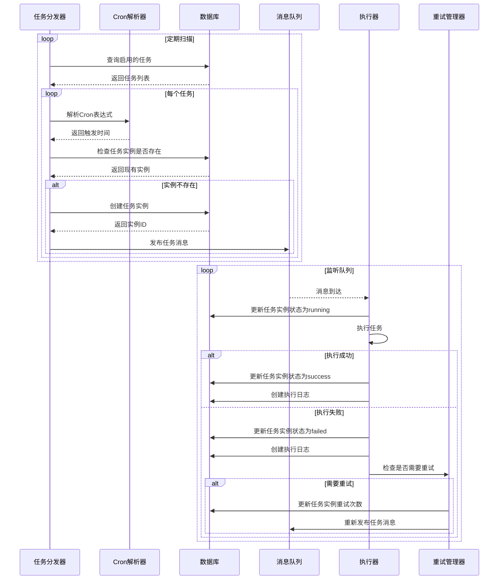
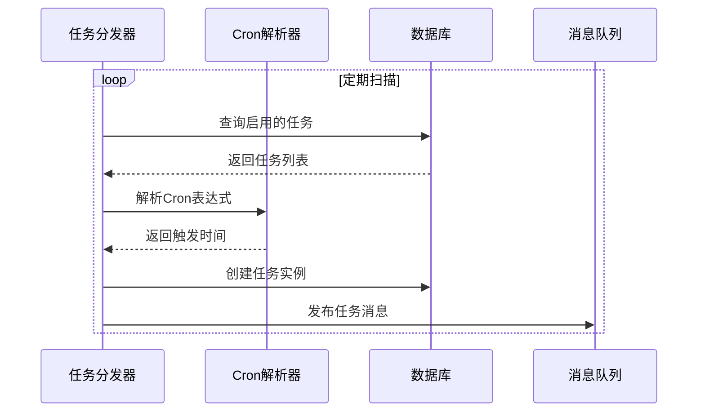
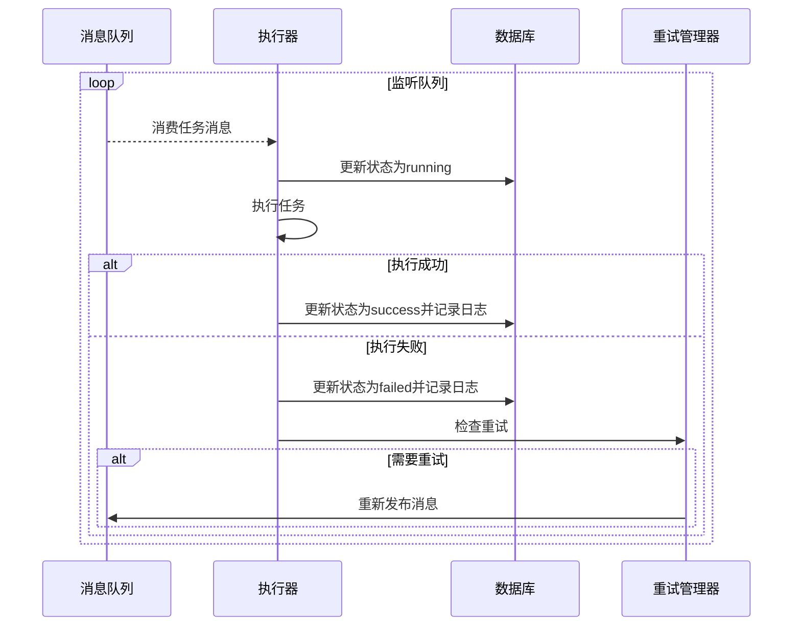

# 完整时序图

```mermaid
sequenceDiagram
    participant Dispatcher as 任务分发器
    participant CronParser as Cron解析器
    participant MongoDB as 数据库
    participant RabbitMQ as 消息队列
    participant Executor as 执行器
    participant RetryManager as 重试管理器

    loop 定期扫描
        Dispatcher->>MongoDB: 查询启用的任务
        MongoDB-->>Dispatcher: 返回任务列表
        loop 每个任务
            Dispatcher->>CronParser: 解析Cron表达式
            CronParser-->>Dispatcher: 返回触发时间
            Dispatcher->>MongoDB: 检查任务实例是否存在
            MongoDB-->>Dispatcher: 返回现有实例
            alt 实例不存在
                Dispatcher->>MongoDB: 创建任务实例
                MongoDB-->>Dispatcher: 返回实例ID
                Dispatcher->>RabbitMQ: 发布任务消息
            end
        end
    end

    loop 监听队列
        RabbitMQ-->>Executor: 消息到达
        Executor->>MongoDB: 更新任务实例状态为running
        Executor->>Executor: 执行任务
        alt 执行成功
            Executor->>MongoDB: 更新任务实例状态为success
            Executor->>MongoDB: 创建执行日志
        else 执行失败
            Executor->>MongoDB: 更新任务实例状态为failed
            Executor->>MongoDB: 创建执行日志
            Executor->>RetryManager: 检查是否需要重试
            alt 需要重试
                RetryManager->>MongoDB: 更新任务实例重试次数
                RetryManager->>RabbitMQ: 重新发布任务消息
            end
        end
    end
```

# 简化时序图

```mermaid
sequenceDiagram
    participant Dispatcher as 任务分发器
    participant CronParser as Cron解析器
    participant MongoDB as 数据库
    participant RabbitMQ as 消息队列

    loop 定期扫描
        Dispatcher->>MongoDB: 查询启用的任务
        MongoDB-->>Dispatcher: 返回任务列表
        Dispatcher->>CronParser: 解析Cron表达式
        CronParser-->>Dispatcher: 返回触发时间
        Dispatcher->>MongoDB: 创建任务实例
        Dispatcher->>RabbitMQ: 发布任务消息
    end
```

```mermaid
sequenceDiagram
    participant RabbitMQ as 消息队列
    participant Executor as 执行器
    participant MongoDB as 数据库
    participant RetryManager as 重试管理器

    loop 监听队列
        RabbitMQ-->>Executor: 消费任务消息
        Executor->>MongoDB: 更新状态为running
        Executor->>Executor: 执行任务
        alt 执行成功
            Executor->>MongoDB: 更新状态为success并记录日志
        else 执行失败
            Executor->>MongoDB: 更新状态为failed并记录日志
            Executor->>RetryManager: 检查重试
            alt 需要重试
                RetryManager->>RabbitMQ: 重新发布消息
            end
        end
    end
```
