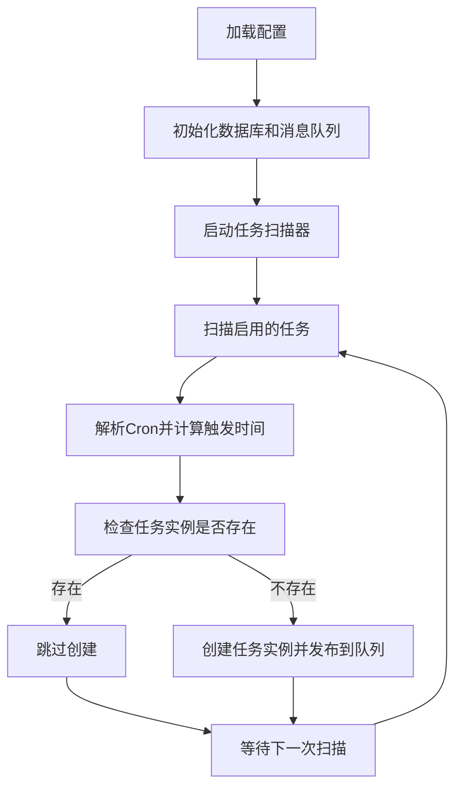
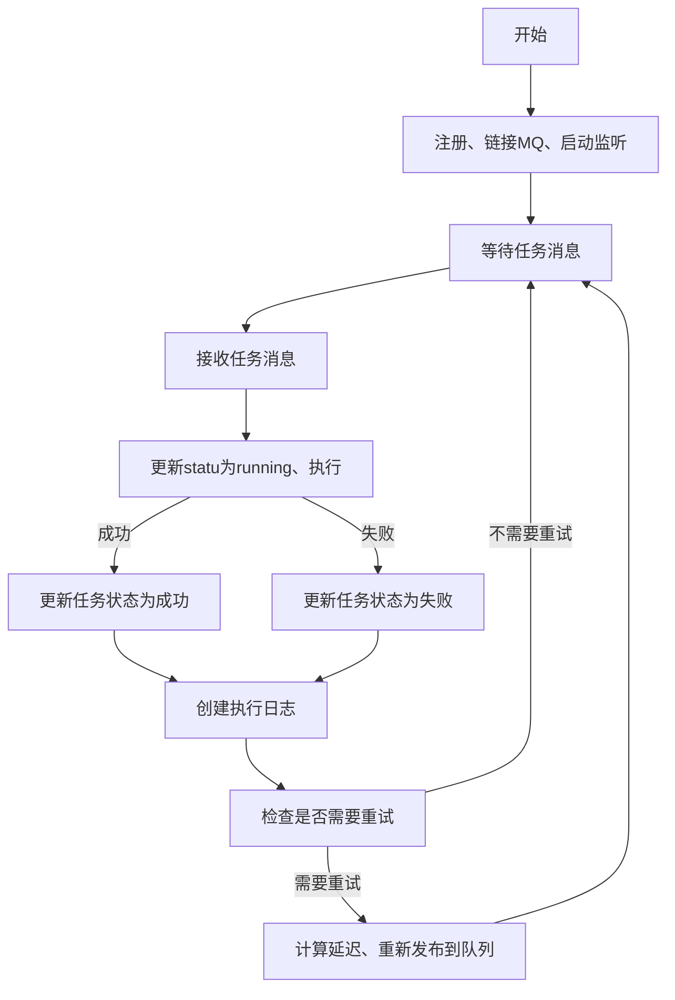
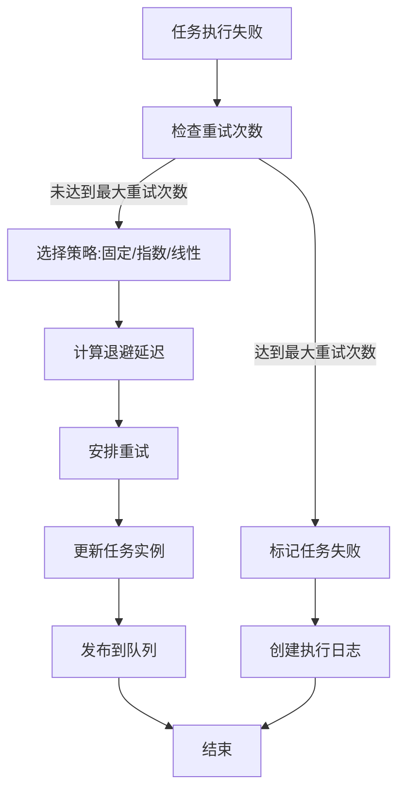
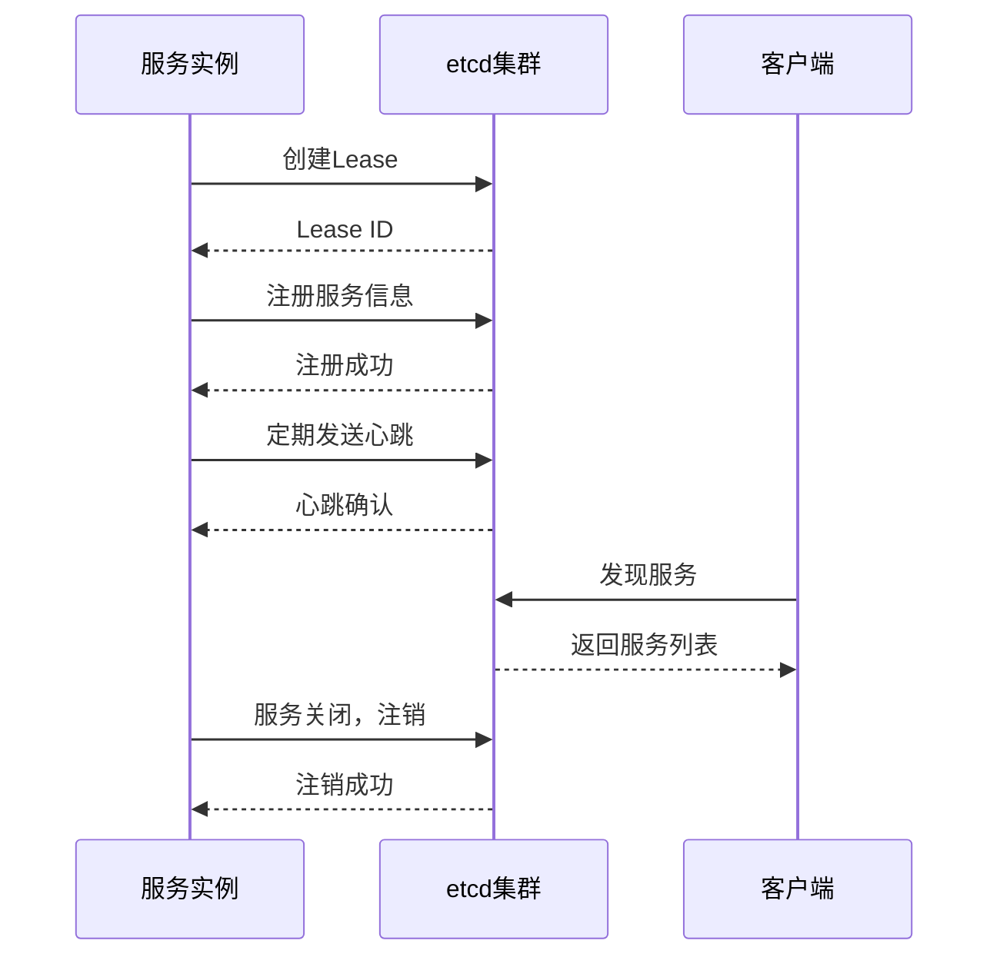

# 4. 系统设计图表

```text
┌─────────────────┐     ┌─────────────────┐     ┌─────────────────┐     ┌─────────────────┐     ┌─────────────────┐
│    表现层       │     │    API层        │     │  业务逻辑层      │     │  数据访问层      │     │  基础设施层      │
│ ┌─────────────┐ │     │ ┌─────────────┐ │     │ ┌─────────────┐ │     │ ┌─────────────┐ │     │ ┌─────────────┐ │
│ │ Web管理界面  │─┼────>│ │ RESTful API │─┼────>│ │  调度器     │─┼────>│ │  MongoDB    │─┼────>│ │ Tokio运行时 │ │
│ └─────────────┘ │     │ └─────────────┘ │     │ └─────────────┘ │     │ └─────────────┘ │     │ └─────────────┘ │
│ ┌─────────────┐ │     │                 │     │ ┌─────────────┐ │     │ ┌─────────────┐ │     │ ┌─────────────┐ │
│ │  API文档    │─┼────>│                 │     │ │  执行器     │─┼────>│ │  RabbitMQ   │─┼────>│ │ 网络通信    │ │
│ └─────────────┘ │     │                 │     │ └─────────────┘ │     │ └─────────────┘ │     │ └─────────────┘ │
└─────────────────┘     └─────────────────┘     │ ┌─────────────┐ │     │ ┌─────────────┐ │     │ ┌─────────────┐ │
                                                │ │  协调器     │─┼────>│ │   etcd      │─┼────>│ │ 日志系统    │ │
                                                │ └─────────────┘ │     │ └─────────────┘ │     │ └─────────────┘ │
                                                │ ┌─────────────┐ │     └─────────────────┘     └─────────────────┘
                                                │ │ 重试管理器   │ │
                                                │ └─────────────┘ │
                                                └─────────────────┘
```

```text
┌──────────────────────────────────────────────────────┐
│                      表现层                          │
│        [ Web管理界面 ]   [ API文档 ]                 │
└──────────────────────────────────────────────────────┘
                          │
                          ▼
┌──────────────────────────────────────────────────────┐
│                       API层                          │
│                   [ RESTful API ]                    │
└──────────────────────────────────────────────────────┘
                          │
                          ▼
┌──────────────────────────────────────────────────────┐
│                   业务逻辑层                         │
│ [ 调度器 ] [ 执行器 ] [ 协调器 ] [ 重试管理器 ]      │
└──────────────────────────────────────────────────────┘
                          │
                          ▼
┌──────────────────────────────────────────────────────┐
│                   数据访问层                         │
│     [ MongoDB ]   [ RabbitMQ ]   [ etcd ]            │
└──────────────────────────────────────────────────────┘
                          │
                          ▼
┌──────────────────────────────────────────────────────┐
│                   基础设施层                         │
│ [ Tokio运行时 ] [ 网络通信 ] [ 日志系统 ]            │
└──────────────────────────────────────────────────────┘
```

## 4.1 调度器工作流程图



## 4.2 执行器工作流程图



## 4.3 重试策略流程图



## 4.4 服务注册与发现流程图


